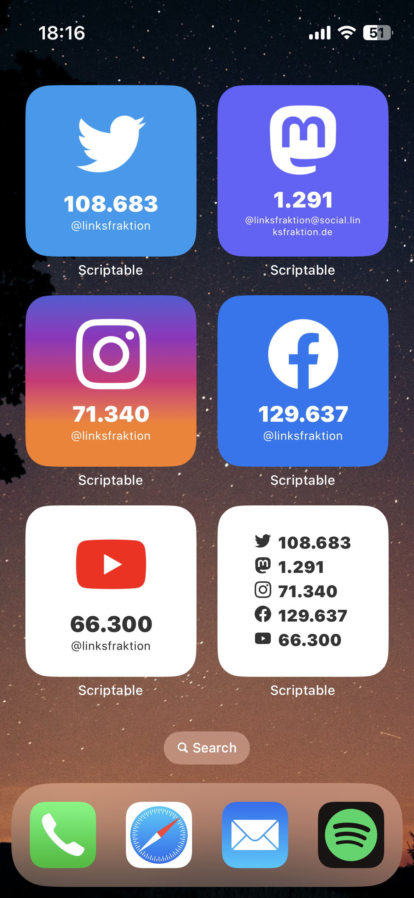
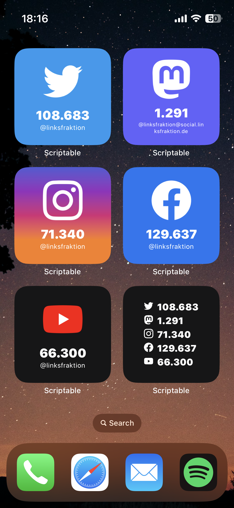

# scriptable-follower-count-widget
A simple widget to display social media follower counts using [simonbs](https://github.com/simonbs)' app [scriptable](https://scriptable.app).

## Functionality
* display follower/like/subscriber count for:
	* Twitter
	* Mastodon
	* Instagram
	* Facebook
	* YouTube
* create widgets for multiple accounts on the same platform using parameters
* see a graph of your followers over time (in development)

# Screenshots

# Installation
1. install [scriptable](https://scriptable.app)
2. copy follower-count.js to your scriptable folder in iCloud or copy the code directly into a new script in the scriptable app
3. fill in your preferred default usernames in the setup section in the beginning of the script

# Usage
1. create a scriptable widget on your homescreen (chosse follower-count.js)
2. fill in parameters (optional)
3. wait a few seconds until all data is fetched

## Parameters
| **prefix**                                                               | **value(s)**                                                                                                 | **examples**                                                                                                                   | **explanation**                                                                                                                                                                         |
|--------------------------------------------------------------------------|--------------------------------------------------------------------------------------------------------------|--------------------------------------------------------------------------------------------------------------------------------|-----------------------------------------------------------------------------------------------------------------------------------------------------------------------------------------|
| "display"                                                                | "twitter", "mastodon", instagram", "facebook", "youtube", "all", or a combination, e.g. "twitter,instagram". | "display:twitter", "display:twitter,instagram", "display:all"                                                                  | choose social network(s) to display (optional; default: all)                                                                                                                            |
| network name ("twitter", "mastodon", "instagram", "facebook", "youtube") | your username (without a leading "@")                                                                        | "display:twitter; twitter:aluhutt", "mastodon:jannis@hutt.social", "display:all; mastodon:jannis@hutt.social; twitter:aluhutt" | overwrite username(s) (optional; overwrites default usernames in the config section below). this allows you to create widgets for different accounts on the same social media platform. |
| "hidelabel"                                                              | "true", "false"                                                                                              | "hidelabel:true", "hidelabel" (interpreted like hidelabel:true), "hidelabel:false"                                             | hide "Followers" / "Subscribers" label (optional; default: set in the script's setup section)                                                                                           |

# Development 
## Roadmap
- [x] find "ways" (api hacks) to get data from the initial five platforms
- [x] create small widget that displays only one platform
- [x] create small widget that displays multiple platforms
- [ ] write cache function that allows caching of followers over time (prerequisite for the graph feature)
- [ ] create medium-sized widget that displays only one platform + graph
- [ ] create medium-sized widget that displays multiple platforms
- [ ] create large-sized widget that displays only one platform + graph
- [ ] create large-sized widget that displays multiple platforms
- [ ] better error reporting
- [ ] add support for more platforms (e.g. Flickr)
- [ ] add support for more metrics than just follower counts

## Known Bugs
no bug tracked yet. create an issue to let me know.
